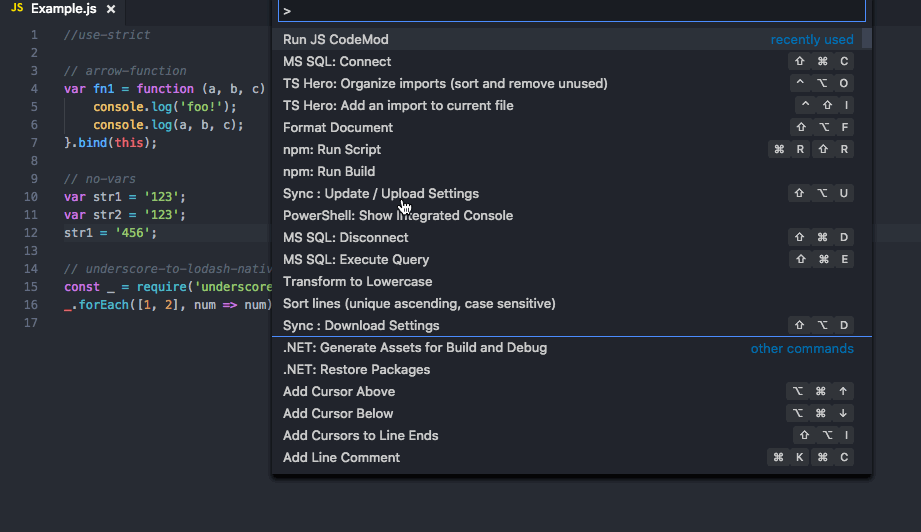

# VS Code JavaScript Booster [](https://travis-ci.org/xsburg/vscode-javascript-booster)

Make your life easier, use code actions to do repetitive tasks for you! They can do a lot, just follow the light bulb [💡]!

This VS Code extension provides various code actions (quick fixes) when editing code in JavaScript (or TypeScript/Flow). Just note the light bulb at the left and press it to learn how you can transform the code under the cursor.

It might worth assigning a shortcut to open the bulb, search for `editor.action.quickFix` command.

## Installation

Install through VS Code extensions. Search for `JavaScript Booster`

[Visual Studio Code Market Place: JavaScript Booster](https://marketplace.visualstudio.com/items?itemName=sburg.vscode-javascript-booster)

Can also be installed using

```
ext install vscode-javascript-booster
```

<!--  -->

## Supported code actions

* [x] Flip if-else
* [x] Remove redundant else
* [x] Replace if-else with ?:
* [x] Convert shorthand arrow function to statement
* [x] Convert to shorthand arrow function
* [x] Replace string with template string
* [x] Replace template string with regular string
* [x] Wrap value with {} (JSX attributes)
* [x] Convert var to let
* [x] Convert var to const
* [x] Split into multiple declarations
* [x] Split into declaration and initialisation
* [x] Merge declaration and initialisation
* [ ] Flip ?:

## Roadmap

* [ ] Extend/Shrink selection
* [ ] Duplicate line/selection
* [ ] Support loading code actions from the workspace directory

## Inspiration

Largely inspired by [WebStorm](https://www.jetbrains.com/webstorm) and its variety of code refactorings. The extension uses [Babylon](https://github.com/babel/babel/tree/master/packages/babylon) to parse the code and then manipulates the abstract syntax tree using [jscodeshift](https://github.com/facebook/jscodeshift).

<!-- ## Extension Settings

Include if your extension adds any VS Code settings through the `contributes.configuration` extension point.

For example:

This extension contributes the following settings:

* `myExtension.enable`: enable/disable this extension
* `myExtension.thing`: set to `blah` to do something

## Known Issues

Calling out known issues can help limit users opening duplicate issues against your extension.

## Release Notes

Users appreciate release notes as you update your extension.

### 1.0.0

Initial release of ...

### 1.0.1

Fixed issue #.

### 1.1.0

Added features X, Y, and Z.
 -->
