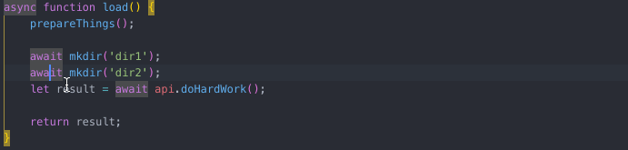
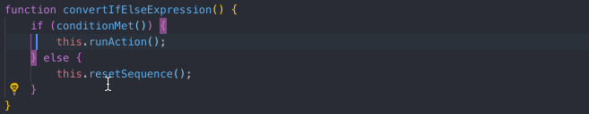
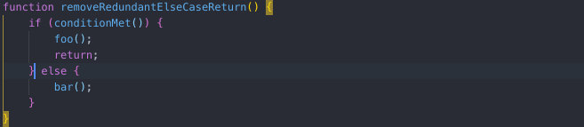
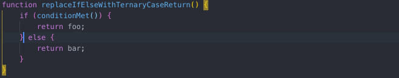
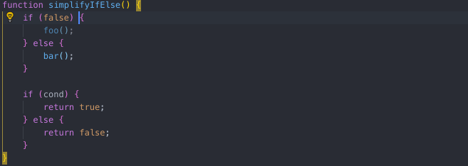
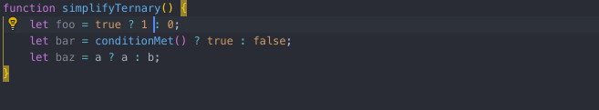

# VS Code JavaScript Booster   

Make your life easier, use code actions to do repetitive tasks for you! They can help a lot, just follow the light bulb 💡!

This VS Code extension provides various code actions (quick fixes) when editing code in JavaScript (or TypeScript/Flow). Just note the light bulb at the left and press it to learn how you can transform the code under the cursor.

You might want to reassign the default shortcut for the quick fix menu to `Alt+Enter` if you are moving from WebStorm. Search for `editor.action.quickFix` command.

## Installation

Install through VS Code extensions. Search for `JavaScript Booster`

[Visual Studio Code Market Place: JavaScript Booster](https://marketplace.visualstudio.com/items?itemName=sburg.vscode-javascript-booster)

## Features

### Code actions

-   💥 Flip if-else
-   💥 Remove redundant else
-   💥 Replace if-else with ?:
-   💥 Simplify if-else
-   💥 Flip ?:
-   💥 Simplify ?:
-   💥 Convert shorthand arrow function to statement
-   💥 Convert to shorthand arrow function
-   💥 Add parens to single arrow function parameter
-   💥 Convert function to arrow function
-   💥 Replace string with template string
-   💥 Replace template string with regular string
-   💥 Split string under cursor
-   💥 JSX: Wrap value with {} (JSX attributes)
-   💥 JSX: Remove {} from JSX attribute
-   💥 JSX: Collapse/Expand empty tag
-   💥 Convert var/const to let
-   💥 Convert var to const
-   💥 Split into multiple declarations
-   💥 Split into declaration and initialisation
-   💥 Merge declaration and initialisation
-   💥 \[on selection\] Run selected await statements in parallel with `Promise.all`

### Extend/Shrink selections

These two commands allow you to successively select blocks of code so that it's easier to select what you want. Just look at the animation, rather than read this text 🤓. Unlike VS Code's embedded commands (`editor.action.smartSelect.*`), this extension uses an abstract syntax tree under the hood, which provides much more accurate results.

You might want to assign hotkeys for these commands, search for `javascriptBooster.extendSelection` and `javascriptBooster.shrinkSelection`. `Ctrl+W` and `Ctrl+Shift+W` (⌘W and ⌘⇧W) are used in WebStorm by default.

As this feature is only supported in JavaScript and TypeScript for now, you can configure fallback commands that will be called for other file types instead (VS Code's `smartSelect.*` by default). They will also be called if the file has fatal syntax errors.

<!-- ### Run your own code actions (beta)

You can easily load and run your own code actions. -->

## Roadmap

### More code actions

-   Convert if -> switch-case
-   Replace ?: with if-else
-   TS: Change member access (public -> private etc)
-   TS: Convert alias to interface
-   TS: Generate missing switch cases for enum
-   ...?

### New commands

-   Duplicate line/selection
-   Navigate to related files (Hello.jsx -> Hello.scss, Hello.spec.jsx)

### Others

-   Support loading code actions from user workspace: users can create their own, project-related refactorings! 😅

## Inspiration

Largely inspired by [WebStorm](https://www.jetbrains.com/webstorm) and its variety of code refactorings. The extension uses [Babylon](https://github.com/babel/babel/tree/master/packages/babylon) to parse the code and then manipulates the abstract syntax tree using [jscodeshift](https://github.com/facebook/jscodeshift).

## Contribution

PRs are always welcome. Please refer to the [Contribution Guide](CONTRIBUTING.md) for tips on how to work with this project. The guide includes basic development workflows like running tests and debugging as well as useful links for creating new code actions.

If you like this project and find it useful, you can buy me a beer through paypal . The beer will be greatly appreciated and help me continue the development. 🧐

## Release Notes

### 0.11.0

-   Add new range-based code action: `Call await statements in parallel with Promise.All()` (#7):

    

-   Add new option to adjust formatting for generated code (only needed when a code action generates new code, the formatting of the unaffected code is always preserved). See `javascriptBooster.formattingOptions` and #10.
-   Bumped @babel/parser, adds proper Angular support (#13).
-   Fixed `Convert to arrow function` refactoring, now works correctly with async functions (#11).
-   Fixed `replace if-else with ?:` refactoring, now supports refactoring of pure expressions:

    

### 0.10.0

-   [VSCode API] Switched to using selection parameter passed into `provideCodeActions()` (Fixes #5)
-   `JSX: Expand empty tag` now puts the cursor between the tags when executed.
-   `Split string under cursor` now puts selection before the second string when executed.
-   `Split string under cursor` no longed triggers outside string quotes.
-   `Remove redundant else` now supports the case when `if` branch ends with return statement:

    

-   `Replace with ternary` can now replace conditional return statements:

    

-   Added new action: `Simplify if-else`.

    

-   Added new action: `Simplify ?:`.

    

### 0.9.0

-   Improved language server performance when available code actions are computed.
-   Fixed `Split string literal under the cursor`, now works well with a series of concatenations (`'foo' + 'bar][baz' => 'foo' + 'bar' + 'baz'`) and respects escape sequences.
-   Fixed `App parens to arrow function parameter`, renamed into `Wrap parameter with ()` to avoid confusion with `Add braces to arrow function` and now always puts the cursor at the end of the parameter.
-   Fixed a number of string actions becoming available when under string literals which cannot be transformed (e.g. inside imports, TS enums etc).

### 0.8.0

-   Extracted all AST-related operations into a Language Server. Massively improves UI responsiveness, particularly when working with large files. 🔥
-   Added new code action: `Split string literal under the cursor`.
-   Fixed `Split into declaration and initialization` to work when inside a function/arrow expression.

### 0.7.0

-   Optimized code action performance on large files. Only the transformed fragment of the code is replaced when an action is applied.
-   Fixed Extend/Shrink selections fallback commands not working due to missing extension activation points.

### 0.6.0

-   Changed `Split into declaration and initialization` action:

    -   It no longer appears in the bulb when the cursor is inside a variable initializer.
    -   It no longer appears in the bulb when variable declaration is a part of ES6 module export.

-   Changed `Convert to shorthand arrow function` action: it now supports transformation of Expression Statements (without explicit return).

### 0.5.0

-   Added new inline code actions.

    -   Add parens to arrow function parameter
    -   Remove braces from JSX attribute

-   Added support for multiple cursors in smart selection commands.
-   Changed `Replace if-else with ?:` action: it now supports if-return-else-return scenario.
-   Fixed `Collapse/Expand empty tag` action: it previously didn't work when the element is nested into a JSX attribute.

### 0.4.0

-   Added new inline code actions.

    -   Flip ?:
    -   Convert function to arrow function
    -   Convert const -> let
    -   JSX: Collapse/Expand empty tag

-   Added support for TypeScript 2.7 (definite assignment assertion modifier in class property definitions) through upgrading to the latest Babylon.

-   Changed `Split into declaration and initialization` action: it can now split const declarations.

-   Fixed #1: Sequence of string literals doesn't convert properly when transforming to template literal.

-   Fixed smart selection extension for collapsed JSX elements.

### 0.3.0

-   Added new smart selection commands for JavaScript and TypeScript (with behavior very close to those in WebStorm). When used in other languages, the fallback commands defined in settings are used.

    -   `javascriptBooster.extendSelection`
    -   `javascriptBooster.shrinkSelection`

-   Added a command to run global code actions.
-   Added support for external code actions, you can run them from a directory inside your workspace (the directory path is defined is settings, `/codemods` by default).

### 0.2.0 (Initial release)

-   Added the following inline code actions. The list will keep expanding in later releases.

    -   Flip if-else
    -   Remove redundant else
    -   Replace if-else with ?:
    -   Convert shorthand arrow function to statement
    -   Convert to shorthand arrow function
    -   Replace string with template string
    -   Replace template string with regular string
    -   Wrap value with {} (JSX attributes)
    -   Convert var to let
    -   Convert var to const
    -   Split into multiple declarations
    -   Split into declaration and initialisation
    -   Merge declaration and initialisation

## Credits

The icon made by [Swifticons](https://www.flaticon.com/authors/swifticons) from [www.flaticon.com](https://www.flaticon.com/) is licensed by [CC 3.0 BY](http://creativecommons.org/licenses/by/3.0/)

<!-- ## Extension Settings

Include if your extension adds any VS Code settings through the `contributes.configuration` extension point.

For example:

This extension contributes the following settings:

* `myExtension.enable`: enable/disable this extension
* `myExtension.thing`: set to `blah` to do something

## Known Issues

Calling out known issues can help limit users opening duplicate issues against your extension.

* Fix canRun() for string literals in enums
* Allow Split declaration & initialization for const variables, makes little sense otherwise if const used everywhere

 -->
